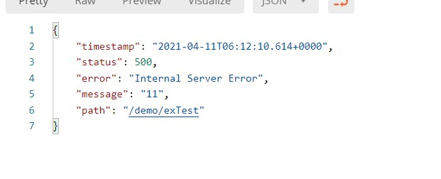
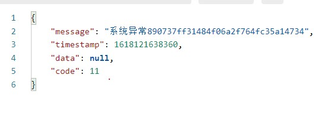

# test-starter - 自定义的starter


### META-INF/spring.factories
> 实现可拔插生效的重要配置  
> 文件中配置的自动配置类，会在springboot启动时自动加载并实例化。
> 当前主要有连个自动配置类
> 1. `RestTemplateAutoConfigure`  
>   1. 这里主要配置`RestTemplate`实例内容。包括 **MyRestTemplateInterceptor拦截器**、连接超时时间、读取超时时间、ssl等
> 2. `TesterStarterAutoConfigure`  
>   1. 配置了异常拦截器： `com.tester.testerstarter.autoconfigure.TesterStarterAutoConfigure.getBusinessExceptionHandler`
>      1. 异常拦截实现类： `com.tester.testerstarter.exception.BusinessExceptionHandler`   
>这里配置了哪些异常需要拦截，拦截后会做什么事情
>      2. 测试： `com.tester.testerwebapp.controller.mono.UserController.exTest`
>      3. 未捕捉/已捕捉的返回区别： 
>         
>         
>   2. 配置了国际化工具： `com.tester.testerstarter.autoconfigure.TesterStarterAutoConfigure.getLanguageUtil`
>      1.  `TesterStarterAutoConfigure` 上使用@Import注解导入 `@Import({ LanguageConfig.class})` 类
---  

### InitializingBean 接口
> `com.tester.testerstarter.util.RestTemplateUtil` 这个类实现 InitializingBean的方法 afterPropertiesSet。属性注入完成后会被调用
> ```
>      @Override
>      public void afterPropertiesSet() throws Exception {
>          // 暂时不需要
>          // 获取accesstoken失败的时候，返回的数据流类型是：octet-stream 不是json，无法读取。所以即使加了这个errorhandler也无法处理
>          //restTemplate.setErrorHandler(new MyResponseErrorHandler());  
>      }
> ```


